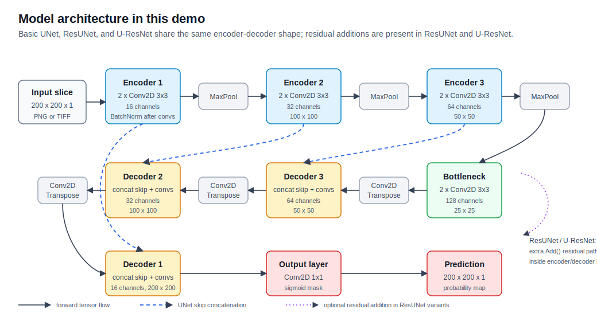
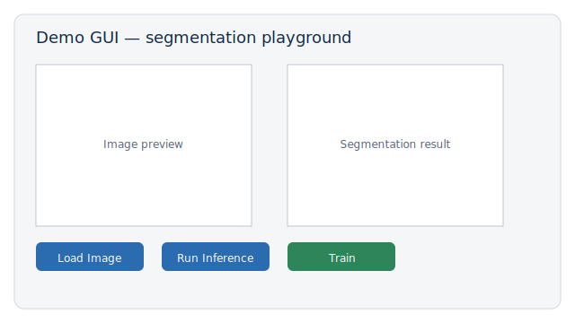
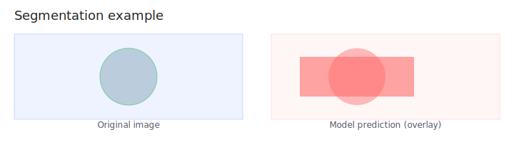

# Unet-Plus-Project-Public-Demo

A concise public demo showcasing a Unet++-style segmentation project
with a lightweight GUI for training, inference, and visualization.

This repository packages working model architectures and a minimal app
that makes it easy to try segmentation workflows locally.

Key files:
- [app/app.py](app/app.py#L1) — small GUI/demo entrypoint
- [app/model_architecture/B_Unet.py](app/model_architecture/B_Unet.py#L1) — example model
- [requirements.txt](requirements.txt#L1) — Python dependencies

Quick start
----------
Install dependencies and run the demo app:

```bash
pip install -r requirements.txt
python app/app.py
```

Highlights
----------
- Ready-to-run Unet++-style model implementations and utilities in `app/`.
- Simple GUI for running inference, training, and visualizing results.
- Intended as a compact, reproducible demo of segmentation capabilities.

Illustrations
-------------
Below are quick illustrations to show the project components and expected output.

Architecture:



Demo GUI mockup:



Segmentation example:



License
-------
See the [LICENSE](LICENSE) file.
